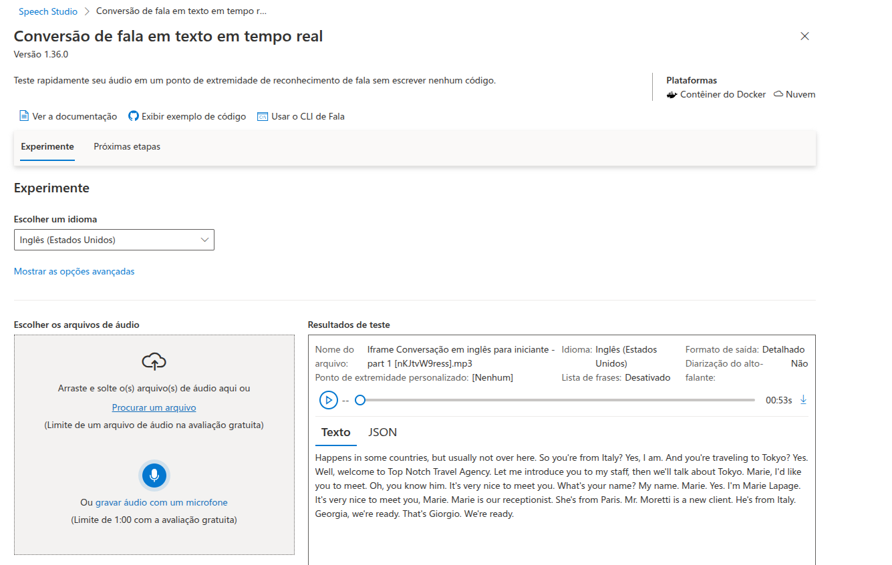
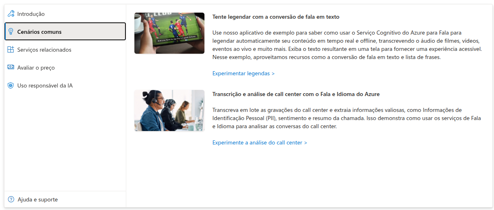
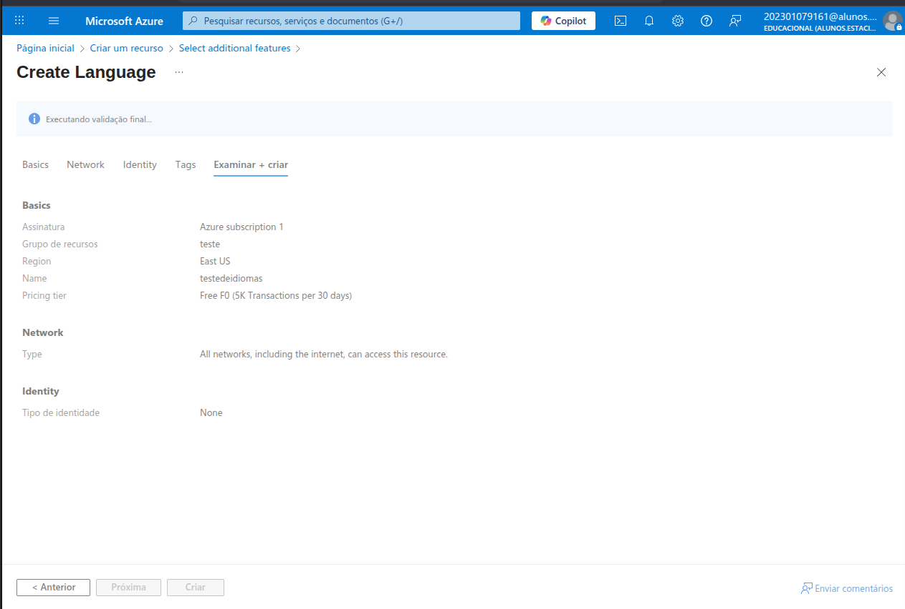
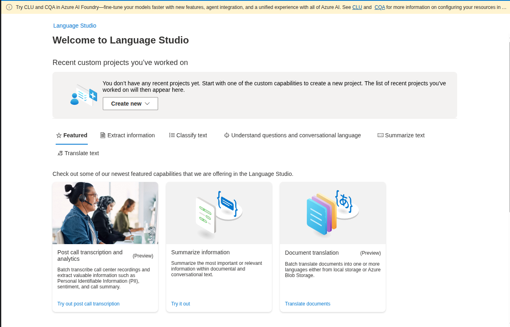
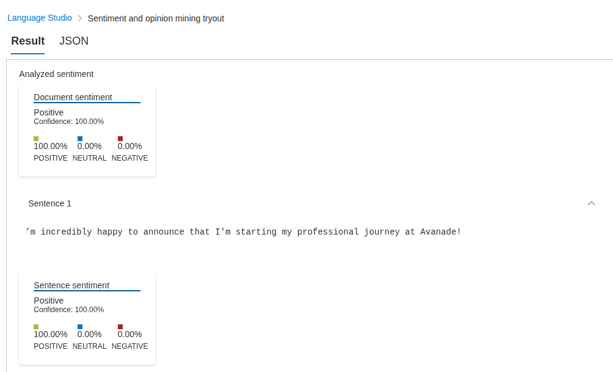
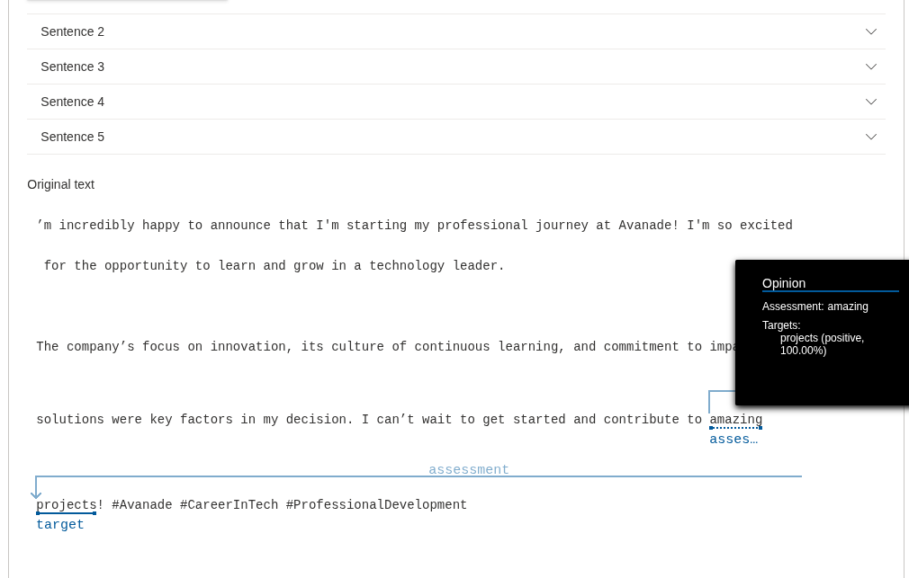

# dio-azure-ia-lab
# Explorando os conceitos abordados e documentando a experiencia no Azure Speech Studio

## - Explorando a conversação de fala em texto em tempo real com o Azure Speech Service.
## - O audio que eu escolhi foi desse vídeo do youtube: https://www.youtube.com/shorts/nKJtvW9ress

## - O resultado foi esse:

## A Conversão de fala em texto em tempo real no speech oferece uma série de benefícios importantes, especialmente em ambientes profissionais e de comunicação.

## Benefícios
## Acessibilidade e Inclusão:

## Torna o conteúdo falado acessível para pessoas com deficiência auditiva, permitindo que elas acompanhem conversas, palestras e vídeos.

## Em eventos ao vivo ou reuniões, a transcrição em tempo real garante que todos os participantes possam entender o que está sendo dito, independentemente de barreiras de áudio.

## Melhoria da Produtividade:

## Em reuniões, a transcrição em tempo real permite que os participantes se concentrem na discussão, em vez de se preocuparem em fazer anotações detalhadas. A transcrição pode ser salva e compartilhada como um registro preciso do que foi discutido.

## Em atendimento ao cliente, os agentes podem ver o que o cliente está dizendo em texto, facilitando a busca por informações relevantes e garantindo um registro claro da conversa.

## Análise e Tomada de Decisão:

## Sistemas de transcrição em tempo real podem ser combinados com análise de sentimento. Isso permite que empresas identifiquem a emoção do cliente em uma chamada, ajudando a ajustar a abordagem do agente.

## No contexto de grandes volumes de dados (big data), a fala é transformada em texto pesquisável. Isso possibilita análises e extração de insights valiosos a partir de conversas.

## Automação e Otimização de Fluxo de Trabalho:

## A conversão de fala em texto é a base para a automação de muitas tarefas. Por exemplo, em centrais de atendimento, a fala pode ser usada para direcionar a chamada para o departamento correto sem a necessidade de digitação.

## Comandos de voz podem ser usados para controlar dispositivos, tornando a interação mais natural e intuitiva.

## - Também explorei um pouco dos cenarios comuns mais utilizados no Azure Speech Studio, como por exemplo a transcrição de fala em tempo real de uma conversa em um callcenter, onde o usuário pode falar com o sistema e o sistema transcreve o que foi falado em tempo real, isso ajuda muito pessoas que não possuem tanto dominio sobre um idioma, e também ajuda a reduzir o custo de operações.

## - Também explorei um pouco dos outros serviços onde você pode escolher uma voz ideal para narrar algum projeto ou documentação, como por exemplo o Speech to Text, onde você pode converter um arquivo de áudio em texto, e o Azure Speech Studio é uma ferramenta poderosa para a transcrição de fala em tempo real, que pode ser usada em muitos contextos, como por exemplo em reuniões, eventos, atendimento ao cliente, etc.

## - No language studio fiz o link com language cognitive

## - Coloquei um texto de 300 caracteres para que a Azure AI pudesse analisar os sentimentos e opiniões.

## - Após a analise do texto, a Azure AI nos retorna uma pontuação de sentimentos, entre positivo, neutro e negativo, que nos ajuda a entender o sentimento geral do texto. E o resultado foi esse:

# Texto usado
## I’m incredibly happy to announce that I'm starting my professional journey at Avanade! I'm so excited for the opportunity to learn and grow in a technology leader.

## The company’s focus on innovation, its culture of continuous learning, and commitment to impactful solutions were key factors in my decision. I can’t wait to get started and contribute to amazing projects! #Avanade #CareerInTech #ProfessionalDevelopment

## - O texto é analisado em sentenças

## - Essa analise é extremamente util para uma empresa por exemplo entender como está sendo avaliado um produto de acordo com as avaliações dos clientes, e assim poderem melhorar o produto para que ele seja mais agradável para os clientes.

# Essa foi minha primeira experiencia com a Azure AI, e foi muito interessante, ainda não tinha tido contato e foi totalmente enriquecedor, e espero que possa continuar utilizando essa ferramenta para ajudar a melhorar meus projetos futuros e ajudar as empresas a melhorar suas estratégias de marketing e vendas.